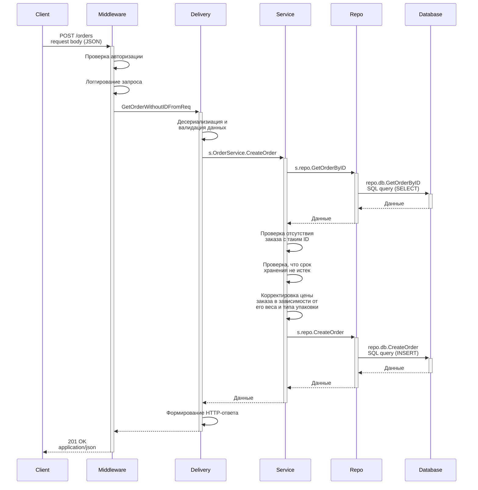

# Бэкенд для работы с ПВЗ

 


## Стек технологий
* [gRPC](https://grpc.io/) - gRPC
* [Postgres](https://www.postgresql.org/) - PostgreSQL
* [pgx](https://github.com/jackc/pgx) - PostgreSQL driver and toolkit for Go
* [goose](https://github.com/pressly/goose) - Database migrations
* [testify](https://github.com/stretchr/testify) - Testing toolkit
* [minimock](https://github.com/gojuno/minimock) - Mocking framework
* [Docker](https://www.docker.com/) - Docker
* [Kafka](https://kafka.apache.org/) - Message broker
* [Redis](https://github.com/go-redis/redis) - Cache
* [Prometheus](https://prometheus.io/) - Prometheus

[//]: # (* [Grafana]&#40;https://grafana.com/&#41; - Grafana)
[//]: # (* [Jaeger]&#40;https://www.jaegertracing.io/&#41; - Jaeger tracing)

## Запуск программы

##### Все в докере
````
Запуск:
    make compose-up
    make migration-up
    curl-запросы

Запуск для тестов:
    Заменить в .env CONFIG_PATH на тестовый
    make compose-up
    make migration-up-test
    make test-integration
    curl-запросы
````

##### Локально приложение, остальное в докере (из-за кафки пока только так работает)
````
Для тестов:
    make compose-up-local
    make run-test           
    make migration-up-test  (в другой консоли)
    make test-integration
    curl-запросы

Не для тестов:
    make compose-up-local
    make run                
    make migration-up       (в другой консоли)
    curl-запросы
````

##### Отличия запуска "в докере" от "локально приложение, остальное в докере"
````
Все в докере:                       Локально приложние, остальное в докере:

    config/config.yaml                  config/config.yaml
        server:
            brokers: ['kafka2:9092']            brokers: ['localhost:9092']
        postgres:                           postgres:
            host: pg_db                         host: localhost
            port: 5432                          port: 5431

    config/config_test.yaml             config/config_test.yaml
        server:                             server:
            brokers: ['kafka2:9092']            brokers: ['localhost:9092']
            redis: 'redis:6379'                 redis: 'localhost:6379'
        postgres:                           postgres:
            host: pg_db_test                    host: localhost
            port: 5432                          port: 5433

    docker-compose.yaml
        kafka2:
            environment:
                KAFKA_ADVERTISED_LISTENERS: 
                    LISTNER_INT://kafka2:29092,LISTENER_EXT://kafka2:9092      | <- в докере
                    LISTNER_INT://kafka2:29092,LISTENER_EXT://localhost:9092   | <- локально
````


## Остановка программы
````bash
doocker compose down
````

или
````bash
bash
docker rm $(docker ps -aq) -f
````


## Запросы к серверу

Первый запрос - для HTTP. Для gRPC такие же, но порт 9002. <br/>
Второй запрос - для HTTPS.

##### Main Page
````bash
curl http://localhost:9000 -i -k -L
````
````bash
curl https://localhost:9001 -i -k
````

##### Create PVZ
````bash
curl --post301 http://localhost:9000/api/v1/pvzs -i -k --location-trusted -u ivan:pvz_best_pass -H 'Content-Type: application/json' -d '{
    "name": "Ozon Tech",
    "address": "Moscow, Presnenskaya nab. 10, block С",
    "contacts": "+7 958 400-00-05, add 76077"
}'
````
````bash
curl -X POST https://localhost:9001/api/v1/pvzs -i -k -u ivan:pvz_best_pass -H 'Content-Type: application/json' -d '{
    "name": "Ozon Tech",
    "address": "Moscow, Presnenskaya nab. 10, block С",
    "contacts": "+7 958 400-00-05, add 76077"
}'
````

##### List of PVZs
````bash
curl http://localhost:9000/api/v1/pvzs -i -k --location-trusted -u ivan:pvz_best_pass
````
````bash
curl https://localhost:9001/api/v1/pvzs -i -k -u ivan:pvz_best_pass
````

##### Get PVZ by ID
````bash
curl -X GET http://localhost:9000/api/v1/pvzs/id -i -k --location-trusted -u ivan:pvz_best_pass -H 'Content-Type: application/json' -d '{
    "id": "9967bb48-bd6f-4ad0-924d-8c9094c4d8c2"
}'
````
````bash
curl -X GET https://localhost:9001/api/v1/pvzs/id -i -k -u ivan:pvz_best_pass -H 'Content-Type: application/json' -d '{
    "id": "9967bb48-bd6f-4ad0-924d-8c9094c4d8c2"
}'
````

##### Update PVZ
````bash
curl -X PUT http://localhost:9000/api/v1/pvzs/id -i -k --location-trusted -u ivan:pvz_best_pass -H 'Content-Type: application/json' -d '{
    "id": "9967bb48-bd6f-4ad0-924d-8c9094c4d8c2",
    "name": "Ozon Company",
    "address": "Moscow, Arbat, 27",
    "contacts": "+7 999 888 11 11"
}'
````
````bash
curl -X PUT https://localhost:9001/api/v1/pvzs/id -i -k -u ivan:pvz_best_pass -H 'Content-Type: application/json' -d '{
    "id": "9967bb48-bd6f-4ad0-924d-8c9094c4d8c2",
    "name": "Ozon Company",
    "address": "Moscow, Arbat, 27",
    "contacts": "+7 999 888 11 11"
}'
````

##### Delete PVZ
````bash
curl -X DELETE http://localhost:9000/api/v1/pvzs/id -i -k --location-trusted -u ivan:pvz_best_pass -H 'Content-Type: application/json' -d '{
    "id": "9967bb48-bd6f-4ad0-924d-8c9094c4d8c2"
}'
````
````bash
curl -X DELETE https://localhost:9001/api/v1/pvzs/id -i -k -u ivan:pvz_best_pass -H 'Content-Type: application/json' -d '{
    "id": "9967bb48-bd6f-4ad0-924d-8c9094c4d8c2"
}'
````

##### Create Order
````bash
curl --post301 http://localhost:9000/api/v1/orders -i -k --location-trusted -u ivan:order_best_pass -H 'Content-Type: application/json' -d '{
    "client_id": "9967bb48-bd6f-4ad0-924d-8c9094c4d8c2",
    "stores_till": "2024-04-22T13:14:01Z",
    "weight": 29,
    "cost": 1100,
    "packaging_type": "box"
}'
````
````bash
curl -X POST http://localhost:9000/api/v1/orders -i -k -u ivan:order_best_pass -H 'Content-Type: application/json' -d '{
    "client_id": "9967bb48-bd6f-4ad0-924d-8c9094c4d8c2",
    "stores_till": "2024-04-22T13:14:01Z",
    "weight": 29,
    "cost": 1100,
    "packaging_type": "box"
}'
````

##### List of orders
````bash
curl http://localhost:9000/api/v1/orders -i -k --location-trusted -u ivan:order_best_pass
````
````bash
curl https://localhost:9001/api/v1/pvzs -i -k -u ivan:order_best_pass
````

##### Get order by ID
````bash
curl -X GET http://localhost:9000/api/v1/orders/id -i -k --location-trusted -u ivan:order_best_pass -H 'Content-Type: application/json' -d '{
    "id": "165dbe30-d0c4-4727-9504-827db76d214e"
}'
````
````bash
curl -X GET https://localhost:9001/api/v1/orders/id -i -k -u ivan:order_best_pass -H 'Content-Type: application/json' -d '{
    "id": "165dbe30-d0c4-4727-9504-827db76d214e"
}'
````

##### Update order
````bash
curl -X PUT http://localhost:9000/api/v1/orders/id -i -k --location-trusted -u ivan:order_best_pass -H 'Content-Type: application/json' -d '{
    "id": "165dbe30-d0c4-4727-9504-827db76d214e",
    "client_id": "9967bb48-bd6f-4ad0-924d-8c9094c4d8c2",
    "stores_till": "2024-04-22T13:14:01Z",
    "weight": 15,
    "cost": 500,
    "packaging_type": "tape"
}'
````
````bash
curl -X PUT https://localhost:9001/api/v1/orders/id -i -k -u ivan:order_best_pass -H 'Content-Type: application/json' -d '{
    "id": "165dbe30-d0c4-4727-9504-827db76d214e",
    "client_id": "9967bb48-bd6f-4ad0-924d-8c9094c4d8c2",
    "stores_till": "2024-04-22T13:14:01Z",
    "weight": 15,
    "cost": 500,
    "packaging_type": "tape"
}'
````

##### Delete order
````bash
curl -X DELETE http://localhost:9000/api/v1/orders/id -i -k --location-trusted -u ivan:order_best_pass -H 'Content-Type: application/json' -d '{
    "id": "165dbe30-d0c4-4727-9504-827db76d214e"
}'
````
````bash
curl -X DELETE https://localhost:9001/api/v1/orders/id -i -k -u ivan:order_best_pass -H 'Content-Type: application/json' -d '{
    "id": "165dbe30-d0c4-4727-9504-827db76d214e"
}'
````

##### List of client orders
````bash
curl -X GET http://localhost:9000/api/v1/orders/client/id -i -k --location-trusted -u ivan:order_best_pass -H 'Content-Type: application/json' -d '{
    "id": "165dbe30-d0c4-4727-9504-827db76d214e"
}'
````
````bash
curl -X GET https://localhost:9001/api/v1/orders/client/id -i -k -u ivan:order_best_pass -H 'Content-Type: application/json' -d '{
    "id": "165dbe30-d0c4-4727-9504-827db76d214e"
}'
````

##### Give out orders
````bash
curl -X PUT http://localhost:9000/api/v1/orders/client/id -i -k --location-trusted -u ivan:order_best_pass -H 'Content-Type: application/json' -d '{
    "client_id": "165dbe30-d0c4-4727-9504-827db76d214e",
    "ids": [
        "427bf09a-59ff-4e2d-b55f-19582037456d",        
        "06db932a-f3b1-49bc-9928-dd5838b38d76"
    ]
}'
````
````bash
curl -X PUT https://localhost:9001/api/v1/orders/client/id -i -k -u ivan:order_best_pass -H 'Content-Type: application/json' -d '{
    "client_id": "165dbe30-d0c4-4727-9504-827db76d214e",
    "ids": [
        "427bf09a-59ff-4e2d-b55f-19582037456d",        
        "06db932a-f3b1-49bc-9928-dd5838b38d76"
    ]
}'
````

##### Return order
````bash
curl -X PUT http://localhost:9000/api/v1/orders/client/id/return -i -k --location-trusted -u ivan:order_best_pass -H 'Content-Type: application/json' -d '{
    "client_id": "427bf09a-59ff-4e2d-b55f-19582037456d",
    "id": "165dbe30-d0c4-4727-9504-827db76d214e"
}'
````
````bash
curl -X PUT https://localhost:9001/api/v1/orders/client/id/return -i -k -u ivan:order_best_pass -H 'Content-Type: application/json' -d '{
    "client_id": "427bf09a-59ff-4e2d-b55f-19582037456d",
    "id": "165dbe30-d0c4-4727-9504-827db76d214e"
}'
````

##### List of returned orders
````bash
curl http://localhost:9000/api/v1/orders/returned -i -k --location-trusted -u ivan:order_best_pass
````
````bash
curl https://localhost:9001/api/v1/orders/returned -i -k -u ivan:order_best_pass
````


##### Дополнительные флаги
    
    -i (--include) Выводит и заголовки, и тело ответа
    -k (--insecure) Игнорирует ошибки SSL сертификата
    -L (--location) Разрешает преадресацию
    --location-trusted Сохраняет данные для аутентификации при переадресации
    -u (--user) Данные для аутентификации
    -d (--data) Данные в теле запроса
    -v (--verbose) Выводит подробную информацию о заголовках и тело ответа


## Консольный режим

go run cmd/cli/main.go help

    Это утилита для управления ПВЗ.

    Применение:
        go run cmd/main.go [flags] [command]
    
    command:            Описание:                                flags:
        create            Принять заказ (создать).                 -clientid=9967bb48-bd6f-4ad0-924d-8c9094c4d8c2 -storestill=15.09.2024
        delete            Вернуть заказ курьеру (удалить).         -id=9967bb48-bd6f-4ad0-924d-8c9094c4d8c2
        giveout           Выдать заказ клиенту.                    -ids=[9967bb48-bd6f-4ad0-924d-8c9094c4d8c2,9967bb48-bd6f-4ad0-924d-8c9094c4d8e4]
        list              Получить список заказов клиента.         -clientid=9967bb48-bd6f-4ad0-924d-8c9094c4d8c2 -lastn=2 -inpvz=true  (последние два опциональные)
        return            Возврат заказа клиентом.                 -id=9967bb48-bd6f-4ad0-924d-8c9094c4d8c2 -clientid=9967bb48-bd6f-4ad0-924d-8c9094c4d8r3
        listofreturned    Получить список возвращенных заказов.    -pagenum=1 -itemsonpage=2

        interactive_mode  Interactive mode to add and get PVZ      No flags. Enter command and follow the instructions
            command:
                add       Create PVZ
                get       Get the information about PVZ

##### Входные данные для консольного режима

    Принять заказ (создать):
        go run cmd/cli/main.go -clientid=9886 -storestill=15.09.2024 create
    Вернуть заказ курьеру (удалить):
        go run cmd/cli/main.go -id=9967bb48-bd6f-4ad0-924d-8c9094c4d8c2 delete
    Выдать заказ клиенту:
        go run cmd/cli/main.go -ids=[9967bb48-bd6f-4ad0-924d-8c9094c4d8d3,9967bb48-bd6f-4ad0-924d-8c9094c4d8c2] giveout
    Получить список заказов:
        go run cmd/cli/main.go -clientid=9967bb48-bd6f-4ad0-924d-8c9094c4d8c2 -lastn=2 -inpvz=true list
    Возврат заказа клиентом:
        go run cmd/cli/main.go -id=9967bb48-bd6f-4ad0-924d-8c9094c4d8c2 -clientid=9967bb48-bd6f-4ad0-924d-8c9094c4d8r1 return
    Получить список возвращенных товаров:
        go run cmd/cli/main.go -pagenum=1 -itemsonpage=2 listofreturned
    Интерактивный режим (Включить, далее следовать его командам)
        go run cmd/cli/main.go interactive_mode


## Архитектура

Демонстрация архитектуры сервера показана на примере этапов запроса создания нового заказа: <br/>
